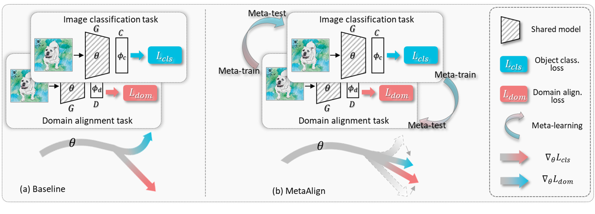

# Unsupervised Domain Adaptation for Computer Vision Tasks

For many computer vision tasks (e.g., image classification, object detection), existing deep learning-based models usually suffer from significant performance degradation when directly applying them to testing data, due to the existence of domain gaps/shifts (e.g., when deployed in new environments, new edge devices, new production lines, where the characteristics of testing images are different from those in training). Our project aims to design unsupervised domain adaptation (UDA) models that are capable to perform well on target domains by exploiting unlabeled target domain data. Such techniques are in highly demand in many practical applications/products due to their low cost (not requiring annotation of the target data) and effectiveness in enhancing the performance. We aim to provide a toolbox that contains a series of effective unsupervised domain adaptation methods. Currently, it includes MetaAlign, ToAlign, etc. 


This includes the official implementation for:
> [**ToAlign: Task-oriented Alignment for Unsupervised Domain Adaptation**](https://arxiv.org/abs/2106.10812),            
> Guoqiang Wei, Cuiling Lan, Wenjun Zeng, Zhizheng Zhang, Zhibo Chen,      
> NeurIPS 2021 | [arXiv](https://arxiv.org/abs/2106.10812)
> 
> [**MetaAlign: Coordinating Domain Alignment and Classification for Unsupervised Domain Adaptation**](https://arxiv.org/abs/2103.13575),            
> Guoqiang Wei, Cuiling Lan, Wenjun Zeng, Zhibo Chen,      
> CVPR 2021 | [arXiv](https://arxiv.org/abs/2103.13575)


## Introduction for MetaAlign

For unsupervised domain adaptation (UDA), to alleviate the effect of domain shift, many approaches align the source and target domains in the feature space by adversarial learning or by explicitly aligning their statistics. However, the optimization objective of such domain alignment is generally not coordinated with that of the object classification task itself such that their descent directions for optimization may be inconsistent. This will reduce the effectiveness of domain alignment in improving the performance of UDA.	In this work, we aim to study and alleviate the optimization inconsistency problem between the domain alignment and classification tasks. We address this by proposing an effective meta-optimization based strategy dubbed (__*MetaAlign*__), where we treat the domain alignment objective and the classification objective as the meta-train and meta-test tasks in a meta-learning scheme. MetaAlign encourages both tasks to be optimized in a coordinated way, which maximizes the inner product of the gradients of the two tasks during training. Experimental results demonstrate the effectiveness of our proposed method on top of various alignment-based baseline approaches, for tasks of object classification and object detection. MetaAlign helps achieve the state-of-the-art performance.
  
 
Figure 1. Illustration of our MetaAlign strategy which aims to encourage the optimization consistency between the domain alignment task and the object classification task for efficient UDA. (a) Previous approaches directly combine the optimization objective functions of the two tasks together, where the descent directions for optimizing the shared network parameters $\theta$ from the two tasks may be inconsistent. (b) In contrast, we treat one of these two tasks as meta-train task and the other as meta-test task. We leverage this meta-optimization based strategy to enforce the consistency between their optimization gradients.	MetaAlign is generic and applicable to various domain alignment based UDAs.  

## Introduction for ToAlign

Unsupervised domain adaptive classifcation intends to improve the classifcation performance on unlabeled target domain. To alleviate the adverse effect of domain shift, many approaches align the source and target domains in the feature space. However, a feature is usually taken as a whole for alignment without explicitly making domain alignment proactively serve the classifcation task, leading to sub-optimal solution. In this work, we propose an effective Task-oriented Alignment (__*ToAlign*__) for unsupervised domain adaptation (UDA). We study what features should be aligned across domains and propose to make the domain alignment proactively serve classifcation by performing feature decomposition and alignment under the guidance of the prior knowledge induced from the classifcation task itself. Particularly, we explicitly decompose a feature in the source domain into a task-related/discriminative feature that should be aligned, and a task-irrelevant feature that should be avoided/ignored, based on the classifcation meta-knowledge.
  

Figure 2. Illustration of adversarial learning based (a) Baseline and (b) our proposed ToAlign. D and C denote domain discriminator and image classifier respectively. (a) Baseline (e.g., DANN directly aligns the target feature f^t with the holistic source feature f^s. Domain alignment and image classification tasks are optimized in parallel. (b) Our proposed ToAlign~makes the domain alignment proactively serve the classification task, where target feature f^t is aligned with source task-discriminative "positive" feature f^s_p which is obtained under the guidance of meta-knowledge induced from the classification task. 

## Usage

### Dependency

```bash
torch>=1.7.0
torchvision>=0.8.0
termcolor>=1.1.0
yacs>=0.1.8
```

### Train

- [x] Single-source UDA on `office_home` dataset:
    ```bash
    # source and target domains can be defined by "--source" and "--target"
    python main.py configs/uda_office_home_toalign.yaml --data_root ROOT_TO_OFFICE_HOME --source [a|c|p|r] --target [a|c|p|r] --output_root exp
    ```
- [x] Multi-source UDA on `DomainNet` dataset:
  ```bash
   python main.py configs/msda_domainnet_toalign.yaml --data_root ROOT_TO_DOMAINNET --target [c|i|p|q|r|s] --output_root exp
  ```
- [ ] Semi-supervised DA on `DomainNet` dataset:

## Citation

```
@inproceedings{wei2021toalign,
  title={ToAlign: Task-oriented Alignment for Unsupervised Domain Adaptation},
  author={Wei, Guoqiang and Lan, Cuiling and Zeng, Wenjun and Zhang, Zhizheng and Chen, Zhibo},
  booktitle={NeurIPS}
}

@inproceedings{wei2021metaalign,
  title={MetaAlign: Coordinating Domain Alignment and Classification for Unsupervised Domain Adaptation},
  author={Wei, Guoqiang and Lan, Cuiling and Zeng, Wenjun and Chen, Zhibo},
  booktitle={CVPR},
  pages={16643--16653},
  year={2021}
}
```

## Contributing

This project welcomes contributions and suggestions.  Most contributions require you to agree to a
Contributor License Agreement (CLA) declaring that you have the right to, and actually do, grant us
the rights to use your contribution. For details, visit https://cla.opensource.microsoft.com.

When you submit a pull request, a CLA bot will automatically determine whether you need to provide
a CLA and decorate the PR appropriately (e.g., status check, comment). Simply follow the instructions
provided by the bot. You will only need to do this once across all repos using our CLA.

This project has adopted the [Microsoft Open Source Code of Conduct](https://opensource.microsoft.com/codeofconduct/).
For more information see the [Code of Conduct FAQ](https://opensource.microsoft.com/codeofconduct/faq/) or
contact [opencode@microsoft.com](mailto:opencode@microsoft.com) with any additional questions or comments.

## Trademarks

This project may contain trademarks or logos for projects, products, or services. Authorized use of Microsoft 
trademarks or logos is subject to and must follow 
[Microsoft's Trademark & Brand Guidelines](https://www.microsoft.com/en-us/legal/intellectualproperty/trademarks/usage/general).
Use of Microsoft trademarks or logos in modified versions of this project must not cause confusion or imply Microsoft sponsorship.
Any use of third-party trademarks or logos are subject to those third-party's policies.

## Acknowledgement

We borrowed some code from [GVB](https://github.com/cuishuhao/GVB) and [DA_Detection](https://github.com/VisionLearningGroup/DA_Detection).
