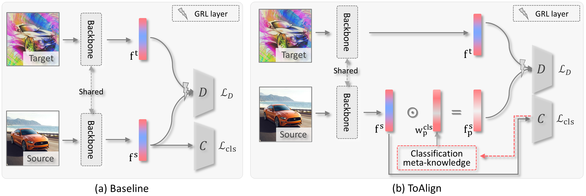

# ToAlign

This is the official implementation for:
> [**ToAlign: Task-oriented Alignment for Unsupervised Domain Adaptation**](http://arxiv.org/abs/2004.01888),            
> Guoqiang Wei, Cuiling Lan, Wenjun Zeng, Zhizheng Zhang, Zhibo Chen,      
> NeurIPS 2021 | [arXiv](https://arxiv.org/abs/2106.10812)

## Abstract

Unsupervised domain adaptive classifcation intends to improve the classifcation performance on unlabeled target domain. To alleviate the adverse effect of domain shift, many approaches align the source and target domains in the feature space. However, a feature is usually taken as a whole for alignment without explicitly making domain alignment proactively serve the classifcation task, leading to sub-optimal solution. In this paper, we propose an effective Task-oriented Alignment (__*ToAlign*__) for unsupervised domain adaptation (UDA). We study what features should be aligned across domains and propose to make the domain alignment proactively serve classifcation by performing feature decomposition and alignment under the guidance of the prior knowledge induced from the classifcation task itself. Particularly, we explicitly decompose a feature in the source domain into a task-related/discriminative feature that should be aligned, and a task-irrelevant feature that should be avoided/ignored, based on the classifcation meta-knowledge.



## Usage

- [x] Single-source UDA on `office_home` dataset:
    ```bash
    # source and target domains can be defined by "--source" and "--target"
    python main.py configs/uda_office_home_toalign.yaml --data_root ROOT_TO_OFFICE_HOME --source [a|c|p|r] --target [a|c|p|r] --output_root exp
    ```
- [ ] Multi-source UDA on `DomainNet` dataset:
- [ ] Semi-supervised DA on `DomainNet` dataset:

## Citation

```
@inproceedings{wei2021toalign,
  title={ToAlign: Task-oriented Alignment for Unsupervised Domain Adaptation},
  author={Wei, Guoqiang and Lan, Cuiling and Zeng, Wenjun and Zhang, Zhizheng and Chen, Zhibo},
  booktitle={NeurIPS}
}

```

## Contributing

This project welcomes contributions and suggestions.  Most contributions require you to agree to a
Contributor License Agreement (CLA) declaring that you have the right to, and actually do, grant us
the rights to use your contribution. For details, visit https://cla.opensource.microsoft.com.

When you submit a pull request, a CLA bot will automatically determine whether you need to provide
a CLA and decorate the PR appropriately (e.g., status check, comment). Simply follow the instructions
provided by the bot. You will only need to do this once across all repos using our CLA.

This project has adopted the [Microsoft Open Source Code of Conduct](https://opensource.microsoft.com/codeofconduct/).
For more information see the [Code of Conduct FAQ](https://opensource.microsoft.com/codeofconduct/faq/) or
contact [opencode@microsoft.com](mailto:opencode@microsoft.com) with any additional questions or comments.

## Trademarks

This project may contain trademarks or logos for projects, products, or services. Authorized use of Microsoft 
trademarks or logos is subject to and must follow 
[Microsoft's Trademark & Brand Guidelines](https://www.microsoft.com/en-us/legal/intellectualproperty/trademarks/usage/general).
Use of Microsoft trademarks or logos in modified versions of this project must not cause confusion or imply Microsoft sponsorship.
Any use of third-party trademarks or logos are subject to those third-party's policies.

## Acknowledgement

We borrowed some code from [GVB](https://github.com/cuishuhao/GVB) and [DA_Detection](https://github.com/VisionLearningGroup/DA_Detection).
